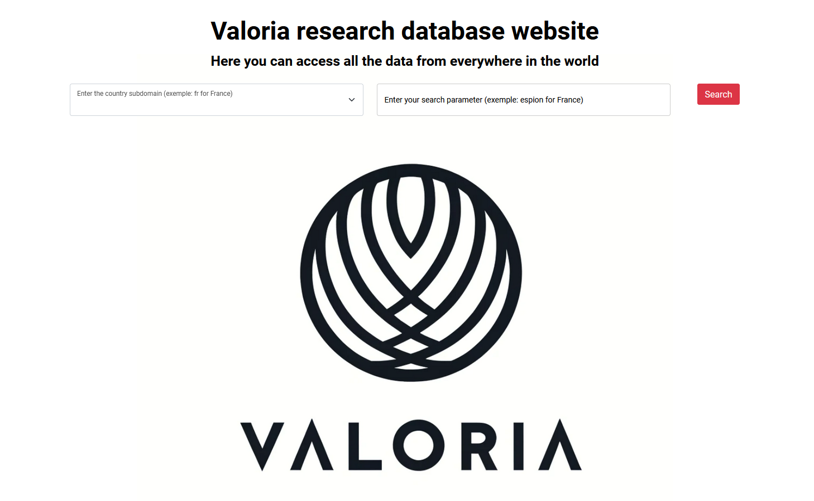
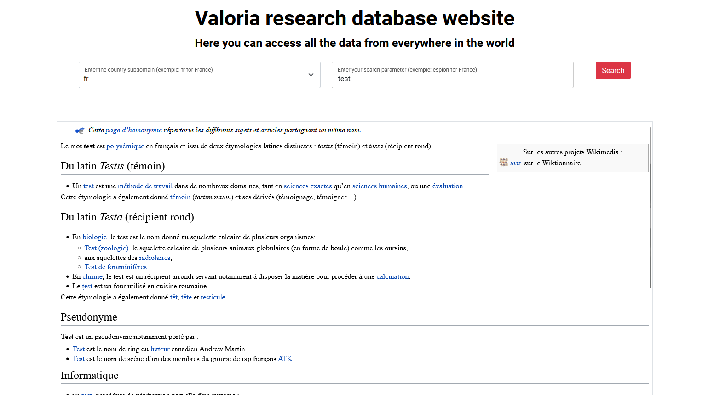
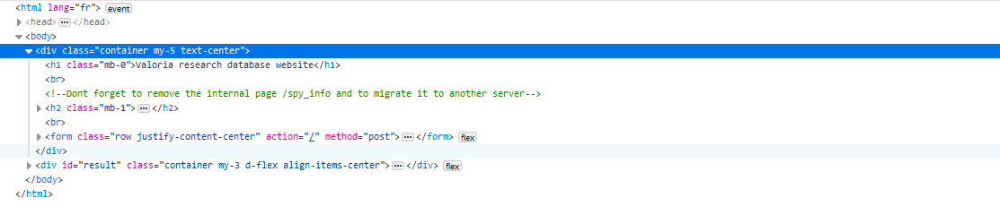
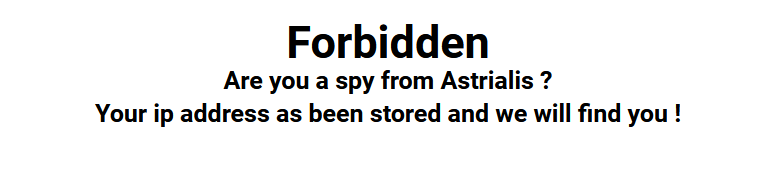
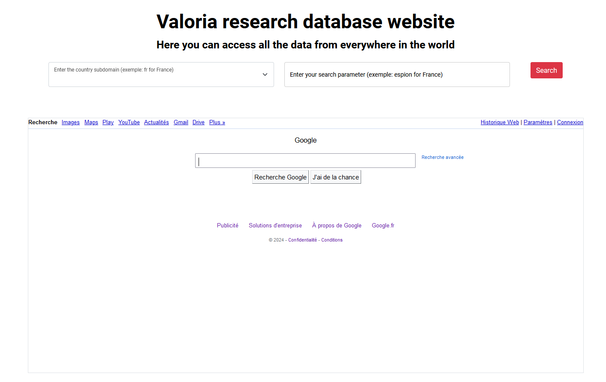
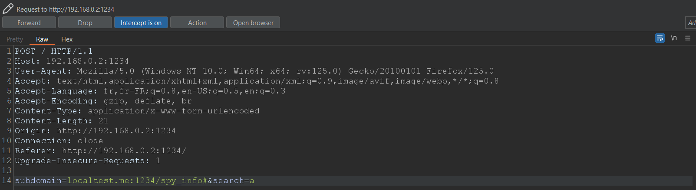
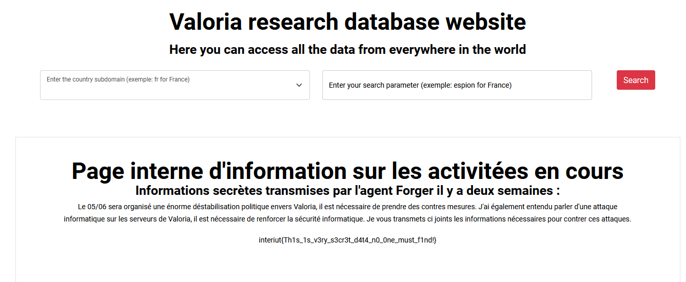

# Valoria Database
> Author: Al-oxos

## Recon

L'application web est très simple, elle présente une interface qui permet de sélectionner un pays et d'entrer un sujet, puis nous retourne après submission une iframe contenant la page wikipedia associé à la recherche dans la langue choisie.





On remarque cependant un commentaire à propos de la page spy_info et lorsqu'on essaie d'y accéder on obtient un 403...





__Time to read the code !__

On a accès au code source, on va donc aller le lire pour comprendre ce qu'il se passe.

L'application fonctionne sur Flask, et implémente deux routes : 

1. La route /spy_info, très clairement celle qui va nous intéresser puisque d'après le code elle permet de retourner le flag si l'adresse IP utilisée lors de la requête est 127.0.0.1.
   
```python
@app.route('/spy_info')
def spy_info():
    ip = request.remote_addr

    if ip != '127.0.0.1':
        return render_template('noflag.html'), 403
    else: 
        flag_file_path = os.path.join(os.path.dirname(__file__), 'flag.txt')
        flag = ""
        with open(flag_file_path, 'r') as f:
            flag = f.readline()
        return render_template('flag.html', flag=flag)
```

2. La route principale (/) qui gère le POST et va réaliser une requete avec nos paramètres auprès de l'api de wikipédia.
```python
@app.route('/', methods=['GET', 'POST'])
def research():
    if request.method == 'POST':
        subdomain = request.form['subdomain']
        search = request.form['search']
        if is_blacklisted(subdomain):
            return render_template('index.html', erreur="Forbidden, who are you trying to mess with ?")

        url = "http://"+subdomain+".wikipedia.org/api/rest_v1/page/html/"+search
        try:
            req = requests.get(url)
            print(req.status_code)
            if req.status_code == 200:
                return render_template('index.html', result=req.text)
            else:
                return render_template('index.html', erreur="Erreur : la requête a échoué avec le code HTTP : "+req.status_code)
        except Exception as e:
            return render_template('index.html', erreur="Erreur : la requête a échoué, veuillez vérifier vos entrées")
    else:
        return render_template('index.html')
```
Du plus, si les paramètres que nous avons rentrés sont contenus dans la blacklist (définies comme si dessous), le serveur nous retourne un message d'erreur indiquant que ce que nous faisons n'est pas très gentil...

La blacklist ainsi que la vérification des entrée sont définies comme cela : 

```python 
blacklist = ['127.0.0.1', 'localhost', '0.0.0.0']

def is_blacklisted(subdomain):
    for item in blacklist:
        if item in subdomain.lower():
            return True
    return False
```
Nous ne pourrons donc pas utiliser d'entrée du style localhost (ainsi que toutes ses variantes avec des majuscules etc...) ainsi que 127.0.0.1.
Cela peut donc nous mener à penser à une SSRF (Server Side Request Forgery) dans l'optique de pouvoir envoyer la requete sur l'endpoint spy_info en utilisant notre url forgé à partir de nos paramètres.

Enfin, nous savons que l'application tourne sur le port 1234.
```python
if __name__ == "__main__":
    app.run(host="0.0.0.0", port=1234)
```

## Challenge solve

Tout d'abord, cherchons à comprendre comment manipuler notre url afin de réussir à faire accéder l'application à l'endpoint spy_info sur localhost sur le port 1234.
Nous voyons que notre url est formé avec nos deux paramètres subdomain et search utilisés dans notre formulaire.
Nos entrées sont ensuites concatenées avec http:// au début puis le domaine de l'api wikipédia.
Si nous arrivons à mettre un payload qui va sur localhost, nous obtenons une url semblable à la suivante :  
```python
subdomain = localhost:1234/spy_info
search = a
url = "http://" + "localhost:1234/spy_info" + ".wikipedia.org/api/rest_v1/page/html/" + "a"
```
Cela semble prometteur, mais en l'état nous ne pourrons rien en tirer car nous concatenons après notre payload de localhost des valeurs qui vont faire échouer la requête.
Pour bypasser cette concaténation et éviter que la requête ne fasse pas ce que nous attendons, nous pouvons rajouter un # ou un ? au sein de notre paramètre subdomain pour spécifier que nous requêtons localhost:1234/spy_info avec derrière soit en argument (en utilisant ?) toute la chaine, soit en ancre de la page (en utilisant #) toute la chaine. 
Notre payload ressemblerait alors à quelque chose de la forme : 
```python
subdomain = localhost:1234/spy_info? ou localhost:1234/spy_info#
search = a
url = "http://" + "localhost:1234/spy_info?" + ".wikipedia.org/api/rest_v1/page/html/" + "a" ou "http://" + "localhost:1234/spy_info#" + ".wikipedia.org/api/rest_v1/page/html/" + "a"
```

Pour vérifier le bon fonctionnement de cette idée (et en sachant que pour le moment localhost est blacklisté), nous pouvons tester avec google.com par exemple.



Notre bypass fonctionne bien, désormais il nous faut un moyen de contourner la blacklist en place. 
Le site [hacktricks](https://book.hacktricks.xyz/pentesting-web/ssrf-server-side-request-forgery/url-format-bypass) propose une page sur le bypass de format d'url pour les SSRF.
Sur cette page, nous pouvons trouver un bon nombre de bypass qui fonctionne dans notre cas.
Notre payload finale sera alors de la forme : 
```python
subdomain = localtest.me:1234/spy_info#
search = a
url = "http://" + "localtest.me:1234/spy_info#" + ".wikipedia.org/api/rest_v1/page/html/" + "a"
```

On modifie nos paramètres via Burp en interceptant la requête (ou directement sur le navigateur via l'onglet Network)



On envoie notre requête et on obtient le flag.




